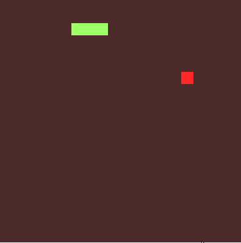

# Simple Javascript snake game



Just download or clone the repository. Open ``snake.html`` in your browser and play!

Start the game by pressing ``Enter`` and use the ``arrow keys`` to move the snake.

You can also just grab the ``snake.js`` file and include it in your own html page.

To run the game in your page, you just have to create an instance of the ``Game`` class, like this:

```javascript
<script src="snake.js"></script>

<script type="text/javascript">

	var game = new Game(20, 10, "stage", "score", "deaths", "max_score");

</script>
```

The arguments are, respectively:

- size of the stage: It will always be a square.
- frames per second: How fast will the game run?
- id of a element in the DOM to display the stage: here is where the snake will appear.
- id of a element in the DOM to display the score: here you will see your score.
- id of a element in the DOM to display the number of deaths: here you will see how bad you are.
- id of a element in the DOM to display the max score: here you will see your max score.

# Credits

The game's logic is based on the implementation of [Jamie Nichols](https://www.youtube.com/channel/UClWw-F8wm4EHDWpVy8sMOXQ/feed) of the same game. You can find a [quick video he made](https://www.youtube.com/watch?v=xRUBaiJvhyo) explaining each part of the code.

I've changed the code to adapt it to my "code style" and added:

- some comentaries to the code;
- colors to the game;
- high score and death counts;
- pause feature;
- more customization through the class constructor.